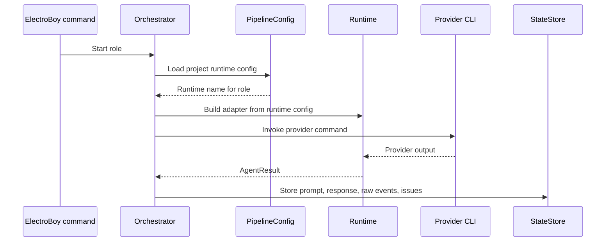

# ElectroBoy Agent CLI Runtime Detailed Design

## Table of Contents

- [Purpose](#purpose)
- [Design Principles](#design-principles)
- [Goals](#goals)
- [Non-Goals](#non-goals)
- [Current State](#current-state)
- [Runtime Model](#runtime-model)
- [Role Model](#role-model)
- [Configuration Schema](#configuration-schema)
- [Adapter Contract](#adapter-contract)
- [Runtime Selection Flow](#runtime-selection-flow)
- [Provider Session Handling](#provider-session-handling)
- [Progress And Monitoring](#progress-and-monitoring)
- [Structured Output Contracts](#structured-output-contracts)
- [GUI Integration](#gui-integration)
- [CLI Management Commands](#cli-management-commands)
- [Security And Environment](#security-and-environment)
- [Failure Handling](#failure-handling)
- [Migration Plan](#migration-plan)
- [Implementation Plan](#implementation-plan)
- [Open Questions](#open-questions)

## Purpose

ElectroBoy should support multiple agent CLIs behind the same workflow. The
operator should be able to open a project and configure different tools for
different roles. A typical setup might use Codex for implementation, Claude for
code review, and a local wrapper for specialized validation or documentation.

The orchestrator remains responsible for workflow state, gate policy, progress
tracking, issue files, artifact paths, and prompt construction. Agent CLIs are
replaceable execution backends. They receive a normalized invocation and return
a normalized result.

## Design Principles

- Runtime selection is per project and per role.
- Codex remains the default runtime.
- The workflow does not depend on one provider's brand, session format, or
  command-line flags.
- Provider-specific behavior is isolated in adapters.
- Review roles must satisfy a strict structured output contract.
- Credentials stay in the user's environment and are never written into run
  artifacts.
- GUI configuration edits the same project config used by the CLI.
- The CLI remains fully functional without the GUI.

## Goals

- Configure a default runtime for a project.
- Configure runtime overrides for individual agent roles.
- Support non-interactive CLIs that receive prompts on stdin.
- Support interactive CLIs that take over a terminal or pseudo-terminal.
- Support provider-specific adapters when a CLI needs special flags, resume
  behavior, or output parsing.
- Display the active runtime for each stage in the GUI.
- Validate that a configured runtime command exists and can satisfy the role.
- Preserve existing Codex behavior as the zero-configuration path.
- Let expert users use a generic wrapper command for tools that do not natively
  match ElectroBoy's contract.

## Non-Goals

- Do not implement direct cloud API integrations in this feature.
- Do not remove the Codex adapter.
- Do not make the orchestrator reason about provider-specific model quality.
- Do not require every provider to support session resume.
- Do not allow provider credentials to be stored in `.electroboy` config.
- Do not hide output-contract failures. Bad provider output must block clearly.

## Current State

ElectroBoy already has a runtime configuration layer:

- `src/electroboy/config.py` loads project runtime configuration.
- `src/electroboy/runtime.py` maps runtime adapters to runtime classes.
- `src/electroboy/adapters/` contains the runtime adapter implementations.
- `electroboy new` writes `.electroboy/project.toml`.
- The CLI pipeline invokes agents through `_invoke_agent_role`.
- `_invoke_agent_role` calls `runtime_for_role`.

The existing default project config maps roles to Codex:

```toml
[runtime]
default = "codex"

[runtimes.codex]
adapter = "codex_exec"
command = "codex"
args = ["exec", "--json"]

[runtimes.codex-interactive]
adapter = "codex_interactive"
command = "codex"

[roles]
design_author = "codex-interactive"
design_author_update = "codex"
design_review = "codex"
coding = "codex"
coding_interactive = "codex-interactive"
code_review = "codex"
```

Several gaps remain:

- The GUI does not expose runtime configuration.
- The GUI service still has direct Codex command paths for ad-hoc and creative
  writing agents.
- Generic interactive CLI support is less complete than Codex interactive
  support.
- Provider diagnostics are not surfaced as a first-class project health view.
- Runtime validation is mostly implicit: failures appear when a role starts.

## Runtime Model

A runtime is a named command configuration. A role points to a runtime. The
runtime points to an adapter.


The runtime configuration contains:

- `name`: logical runtime name.
- `adapter`: adapter implementation name.
- `command`: executable to run.
- `args`: default command arguments.
- `env`: allowlist of environment variables passed to the process.
- `options`: adapter-specific settings.

The orchestrator never directly runs `codex`, `claude`, or another provider
for staged software workflow roles. It asks the runtime layer for the runtime
for a role, builds an `AgentInvocation`, and receives an `AgentResult`.

## Role Model

Roles are the stable interface between the workflow and runtimes. A role
describes intent, not provider identity.

Core software-engineering roles:

- `design_author`
- `design_author_update`
- `design_review`
- `design_review_interactive`
- `coding`
- `coding_interactive`
- `code_review`
- `code_review_interactive`
- `range_code_review`
- `range_code_fix_interactive`
- `test_review`
- `test_review_interactive`
- `validation_review`
- `documentation`
- `documentation_interactive`

Bug workflow roles:

- `bug_investigate_interactive`
- `bug_reproduce_interactive`
- `bug_fix_interactive`
- `bug_validate_interactive`

GUI-only roles that should be moved into the runtime system:

- `ad_hoc`
- `creative_writing`

Default behavior:

- If a role is not explicitly configured, it uses `[runtime].default`.
- Interactive role fallbacks should prefer a configured interactive runtime
  when the project uses the stock Codex default.
- Missing role mappings should not fail as long as the default runtime exists.

## Configuration Schema

Project configuration is stored in the first matching path:

1. `.electroboy/project.toml`
2. `electroboy.toml`
3. `.agent-pipeline/project.toml`
4. `agent-pipeline.toml`

The preferred modern path is `.electroboy/project.toml`.

Example using Codex for implementation and Claude for reviews:

```toml
[runtime]
default = "codex"

[runtimes.codex]
adapter = "codex_exec"
command = "codex"
args = ["exec", "--json"]
env = [
  "PATH",
  "HOME",
  "LANG",
  "LC_ALL",
  "TERM",
  "COLORTERM",
  "TMPDIR",
  "CODEX_HOME",
  "OPENAI_API_KEY",
]
structured_output = "json_schema"

[runtimes.codex-interactive]
adapter = "codex_interactive"
command = "codex"
env = [
  "PATH",
  "HOME",
  "LANG",
  "LC_ALL",
  "TERM",
  "COLORTERM",
  "TMPDIR",
  "CODEX_HOME",
  "OPENAI_API_KEY",
]

[runtimes.claude-review]
adapter = "generic_cli"
command = "claude"
args = ["--print"]
env = [
  "PATH",
  "HOME",
  "ANTHROPIC_API_KEY",
]
structured_output = "prompt_contract"

[roles]
coding = "codex"
coding_interactive = "codex-interactive"
code_review = "claude-review"
range_code_review = "claude-review"
design_review = "claude-review"
test_review = "claude-review"
```

Future schema additions:

```toml
[runtimes.claude-interactive]
adapter = "interactive_cli"
command = "claude"
args = []
env = ["PATH", "HOME", "ANTHROPIC_API_KEY"]
supports_resume = false

[roles]
ad_hoc = "codex-interactive"
creative_writing = "claude-interactive"
```

## Adapter Contract

An adapter converts an `AgentInvocation` into a provider process and converts
provider output into an `AgentResult`.

`AgentInvocation` fields:

- `role`
- `prompt`
- `context_paths`
- `output_schema`
- `provider_session_id`
- `progress_path`

`AgentResult` fields:

- `ok`
- `final_message`
- `issues`
- `raw_events`
- `changed_files`
- `created_files`
- `commands`
- `commit_message`
- `error`
- `provider`
- `provider_session_id`
- `resumed_session`
- `structured_output`
- `structured_payload`

Adapters should be small and provider-specific only where necessary. The base
adapter types are:

- `generic_cli`: sends the prompt to stdin and parses stdout.
- `interactive_cli`: starts a terminal-owning interactive command.
- `codex_exec`: wraps `codex exec --json` and Codex sandbox behavior.
- `codex_interactive`: wraps Codex interactive sessions and resume metadata.
- `manual`: reads a configured response file for testing or manual operation.

New providers should first try `generic_cli` or `interactive_cli`. A dedicated
adapter should be added only when the provider needs special behavior.

## Runtime Selection Flow

The staged CLI path should follow this flow:



The GUI service should not construct provider commands directly. It should
either:

- start an `electroboy <stage>` command that uses the runtime layer, or
- ask the runtime layer to create an `AgentSession` for GUI-only roles.

## Provider Session Handling

Provider session resume is optional.

Codex supports durable session IDs today. ElectroBoy records those in session
records so a later authoring command can resume the same provider conversation.

Other providers may not expose compatible session IDs. Their adapters should
return:

```json
{
  "provider": "claude",
  "provider_session_id": null,
  "resumed_session": false
}
```

Provider-specific session records must include:

- provider name
- runtime name
- adapter name
- provider session id, when available
- role
- stage
- artifact
- event id
- command summary

The resume flow must check that the same provider and adapter are still
configured before passing a stored provider session id back to the runtime.

## Progress And Monitoring

Long-running non-interactive roles receive a progress file path. The prompt
instructs the agent to append concise updates before meaningful steps.

Provider requirements:

- If the provider writes files, it may update the progress file directly.
- If the provider cannot write files, a wrapper runtime may synthesize progress
  from stdout or stderr.
- `electroboy progress` and the GUI progress pane remain provider-neutral.

The progress file remains an ElectroBoy artifact. Providers should not invent
their own progress location.

## Structured Output Contracts

Automated review roles must return structured review output:

```json
{
  "ok": true,
  "final_message": "short human-readable review summary",
  "issues": []
}
```

Each issue must include:

- `issue_id`
- `severity`
- `status`
- `summary`

Optional fields include:

- `commit`
- `artifact`
- `location`
- `rationale`
- `requested_change`

The orchestrator validates the final response. If it is invalid, it may run a
repair prompt through the same runtime. If repair fails, the stage blocks with
the raw response preserved for debugging.

Generic CLIs are usable only if they can reliably emit this final JSON object.
If a provider cannot do that directly, the project should use a wrapper command
that normalizes provider output.

## GUI Integration

The GUI should expose runtime configuration without replacing the config file.

Recommended GUI surfaces:

- Project runtime summary in the project status pane.
- Runtime settings panel under Project.
- Role matrix showing role to runtime mappings.
- Runtime editor for command, args, env allowlist, and options.
- Validation action for each runtime.
- Validation action for each role.

The runtime summary should show:

- default runtime
- runtime selected for the active stage
- provider command
- adapter
- whether the command is available on `PATH`
- whether required environment variables are present
- whether the role requires structured JSON output

Runtime settings should write `.electroboy/project.toml` through service APIs.
The browser must not edit the file directly.

GUI-only agents should become normal roles:

- `Start ad-hoc` uses role `ad_hoc`.
- Creative writing uses role `creative_writing`.

This removes the remaining direct Codex launch paths from the GUI service.

## CLI Management Commands

Runtime configuration should also be manageable from the terminal.

Proposed commands:

```bash
electroboy runtime list
electroboy runtime show
electroboy runtime validate
electroboy runtime validate <runtime-name>
electroboy runtime validate-role <role-name>
electroboy runtime set-role <role-name> <runtime-name>
electroboy runtime add <runtime-name> \
  --adapter generic_cli \
  --command claude \
  --arg --print \
  --env PATH \
  --env HOME \
  --env ANTHROPIC_API_KEY
```

These commands should update `.electroboy/project.toml` and preserve comments
where practical. If comment preservation becomes complex, the implementation
may rewrite only the runtime-managed section and leave a clear generated
marker.

## Security And Environment

Runtime configs should use an environment allowlist. This avoids passing the
entire service or shell environment to provider processes.

Rules:

- Do not store API keys in config files.
- Do not write secrets to raw events, progress files, or messages.
- Keep provider home directories provider-owned.
- Respect provider-specific sandbox options.
- Show the effective environment variable names, not their values.

The service should not automatically inherit every variable from the shell
that started it. Runtime configs should explicitly list what the provider
needs.

## Failure Handling

Configuration errors should fail before starting a stage when possible:

- unknown runtime
- unknown adapter
- missing command
- missing required environment variable
- unsupported role/runtime combination

Invocation errors should be recorded as normal agent failures:

- executable not found
- non-zero exit
- malformed structured output
- missing progress file updates, if that policy is reintroduced
- unsupported provider resume

The failure message should include:

- role
- runtime name
- adapter
- command summary
- remediation hint

Example:

```text
runtime validation failed for role code_review
runtime: claude-review
adapter: generic_cli
command: claude --print
error: ANTHROPIC_API_KEY is not present in the service environment
```

## Migration Plan

Existing projects continue to work because Codex remains the default.

Migration steps:

1. Keep loading current `.electroboy/project.toml`.
2. Add missing role defaults during project activation or initialization.
3. Add `ad_hoc` and `creative_writing` default roles.
4. Keep legacy `electroboy.toml` and `.agent-pipeline/project.toml` loading.
5. Surface a warning when legacy paths are used.
6. Provide a command to migrate config to `.electroboy/project.toml`.

The migration must not overwrite operator-defined runtimes or role mappings.

## Implementation Plan

### Phase 1. Complete Role Coverage

- Add default runtime roles for `range_code_review`, `validation_review`,
  `ad_hoc`, and `creative_writing`.
- Update project config default insertion to include those roles.
- Add tests for all public agent roles.

### Phase 2. Remove Direct Provider Launches From The GUI

- Replace `_ad_hoc_agent_command` with runtime-backed session creation.
- Replace `_creative_writing_command` with runtime-backed session creation.
- Add generic interactive session support for non-Codex providers.
- Preserve Codex resume behavior through `codex_interactive`.

### Phase 3. Runtime Validation

- Add runtime command discovery with `shutil.which`.
- Validate configured env names are present when required.
- Validate adapter names before stage execution.
- Add `electroboy runtime validate`.
- Add GUI project health output for runtime diagnostics.

### Phase 4. GUI Runtime Configuration

- Add Project -> Runtime settings.
- Show runtime list and role matrix.
- Allow changing a role mapping.
- Allow adding a generic CLI runtime.
- Add validation buttons for runtime and role checks.

### Phase 5. Provider-Specific Adapters

- Add dedicated adapters only when the generic adapters are insufficient.
- Candidate adapters:
  - `claude_cli`
  - `aider_cli`
  - `opencode_cli`
- Keep provider-specific code isolated under `src/electroboy/adapters/`.

### Phase 6. Documentation And Examples

- Update README runtime configuration examples.
- Update `docs/api.md`.
- Add troubleshooting examples for malformed provider output.
- Add an example wrapper script for providers that do not emit JSON directly.

## Open Questions

- Should runtime config be stored only per project, or should the service have
  a user-level default runtime profile?
- Should the GUI allow editing command args directly, or should it offer
  provider templates first?
- Should interactive non-Codex providers support attach/resume only when their
  adapter can prove the session is durable?
- Should output-contract repair always use the same review runtime, or should
  there be a dedicated `contract_repair` role?
- Should runtime validation run automatically when opening a project, or only
  when the operator requests it?
