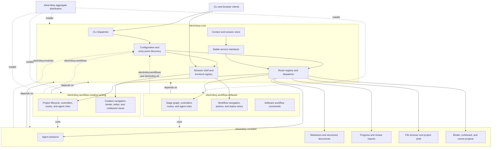

# ElectroBoy Modular Server Detailed Design

## Table of Contents

- [Purpose](#purpose)
- [Production Packaging Goal](#production-packaging-goal)
- [Design Principles](#design-principles)
- [Goals](#goals)
- [Non-Goals](#non-goals)
- [Current Server Shape](#current-server-shape)
- [Target Architecture](#target-architecture)
- [Package Boundaries](#package-boundaries)
- [Core Service](#core-service)
- [Backend Modularity](#backend-modularity)
- [Module Registry](#module-registry)
- [Workflow Registry](#workflow-registry)
- [Reusable Modules](#reusable-modules)
- [Document Modules](#document-modules)
- [Frontend Modularity](#frontend-modularity)
- [Frontend Composition](#frontend-composition)
- [Backend Route Model](#backend-route-model)
- [State And Persistence](#state-and-persistence)
- [Agent Session Model](#agent-session-model)
- [Workflow Composition](#workflow-composition)
- [Plugin Boundary](#plugin-boundary)
- [Testing Strategy](#testing-strategy)
- [Implementation Commit Plan](#implementation-commit-plan)
- [Migration Plan](#migration-plan)
- [Open Questions](#open-questions)

## Purpose

The ElectroBoy service should support multiple workflows and reusable GUI
capabilities without concentrating every behavior in one server module. The
software-engineering workflow, creative-writing workflow, document panes,
corkboards, project shell, agent sessions, and file browser should be composed
from clear modules.

The service remains a local orchestration layer. It owns browser contexts,
project activation, HTTP/SSE transport, session lifecycle, and safe access to
project files. Workflow-specific behavior moves into workflow definitions.
Reusable behavior moves into capability modules.

This design prepares ElectroBoy for built-in workflows, user-defined workflows,
and plugin-provided workflows while keeping the CLI authoritative. The near-term
work is a production-readiness cleanup, not a new workflow feature. The goal is
to separate the current monolithic service into a packageable core plus
separately deliverable workflow packages.

## Production Packaging Goal

ElectroBoy should be deliverable as a small core product with optional workflow
packages. The standard ElectroBoy distribution enables the software-engineering
and creative-writing workflows by default. Customer-specific or paid workflows
are added through configuration and should use the same registry path as the
built-in workflows.

Future product packaging can still ship selected workflow sets. For example, a
customer-specific build can include only the workflows that customer is entitled
to use. The default developer build, however, is expected to include software
engineering and creative writing without requiring extra setup.

This packaging goal drives the modularity work:

- The core package provides service runtime, context management, session
  management, route dispatch, static asset loading, project activation, common
  panes, common file access, and workflow/module registries.
- Workflow packages provide backend controllers, workflow-specific state,
  workflow actions, prompt roles, document schemas, frontend navigation, and
  workflow-specific panes.
- Reusable capability packages provide modules such as corkboards, Markdown
  documents, structured documents, file browser, project shell, progress, and
  review reports.
- Paid or customer-specific workflows can be shipped as separately installed
  packages that register through the same interfaces as built-in workflows.
- Additional workflow factories are persisted in service workflow configuration,
  so a running service can expose more workflows without hardcoding them into the
  core registry.

The first implementation does not need a billing or license server. It must
create clean package boundaries so entitlement and distribution policy can be
added later without another large refactor.

## Design Principles

- Keep the CLI and service aligned around the same workflow state.
- Treat workflows as compositions of reusable capabilities.
- Keep browser-tab state isolated by context id.
- Keep long-running agent processes behind a shared session layer.
- Separate structured documents from plain Markdown documents.
- Separate backend modularity from frontend modularity. Each side needs its own
  registry, package assets, tests, and migration path.
- Let complex GUI capabilities, such as corkboards, be imported by multiple
  workflows.
- Preserve existing behavior while moving code into smaller modules.
- Add plugin loading after built-in workflows use the same registry model.
- Keep route registration explicit and inspectable.
- Avoid frontend behavior that depends on hidden workflow-specific globals.
- Keep optional workflow packages out of core imports unless the workflow is
  installed and enabled.

## Goals

- Split the service into small backend modules with stable responsibilities.
- Move large inline HTML, CSS, and JavaScript into package assets.
- Package the core service separately from workflow implementations.
- Package backend workflow controllers separately from frontend workflow code.
- Add a backend module registry for reusable capabilities.
- Add a frontend module registry for reusable panes, actions, and views.
- Add a workflow registry for software engineering, creative writing, and
  future workflows.
- Let workflows declare the modules, stages, panes, actions, and documents
  they need.
- Let modules register routes, static assets, commands, and state namespaces.
- Preserve per-browser-tab contexts so two tabs can operate different projects.
- Support module reuse across workflows, including corkboards and documents.
- Keep Markdown export, live refresh, pane pop-outs, progress streaming, and
  agent IO available to every workflow that imports the matching module.
- Provide a path to external workflow plugins without rewriting the service.
- Allow production builds to include a selected subset of workflows.

## Non-Goals

- Do not replace the CLI with the service.
- Do not require a web framework migration as part of the first split.
- Do not make plugin loading the first refactor step.
- Do not add customer billing, licensing, or entitlement enforcement in the
  first modularization pass.
- Do not move workflow policy into frontend JavaScript.
- Do not merge structured and unstructured document editing into one model.
- Do not let modules write arbitrary global state outside their namespace.
- Do not require creative-writing projects to contain software-engineering
  artifacts.

## Current Server Shape

The service is implemented mainly in `src/electroboy/service.py`. That file is
large because it contains several independent responsibilities:

- Service constants and workflow metadata.
- The main HTML, CSS, and JavaScript application template.
- Pane-window and file-browser window templates.
- `BrowserContext`, which stores per-tab activation and session state.
- `ServiceState`, which coordinates project, workflow, document, creative, and
  session operations.
- `AgentSession`, which owns PTY process execution and event collection.
- `ElectroBoyHTTPServer` and the request handler.
- Manual HTTP route dispatch with `if path == ...` checks.
- Markdown rendering and artifact editor pages.
- Structured artifact editing.
- Creative project, binder, scratchpad, and corkboard logic.
- Project shell, progress, export, and terminal helpers.
- Command builders for `electroboy`, `codex`, and shell sessions.

The rest of the codebase is more modular. Runtime adapters, prompt generation,
structured artifacts, document export, gates, state store, and upstream
providers already live outside the service. The server should follow the same
direction.

## Target Architecture

The service becomes a small composition layer. It loads reusable modules,
loads workflows, creates a route table, serves static assets, and keeps browser
contexts isolated.

```text
Browser
  |
  | HTTP + SSE
  v
Service Core
  |
  +-- Context Store
  +-- Route Registry
  +-- Session Manager
  +-- Static Asset Server
  +-- Workflow Registry
  |
  +-- Modules
      +-- agent_sessions
      +-- markdown_documents
      +-- structured_documents
      +-- corkboard
      +-- binder
      +-- project_shell
      +-- file_browser
      +-- progress
      +-- recent_projects
      +-- review_reports
```

Workflows depend on modules rather than owning every detail themselves.

```text
Software Engineering Workflow
  imports structured_documents
  imports markdown_documents
  imports agent_sessions
  imports progress
  imports review_reports
  imports project_shell

Creative Writing Workflow
  imports markdown_documents
  imports agent_sessions
  imports binder
  imports corkboard
  imports project_shell
```

## Package Boundaries

The production package should be split into core, reusable modules, and
workflow packages. The boundaries apply to both Python backend code and browser
frontend assets.

```text
electroboy-core
  backend: service runtime, contexts, route registry, sessions, static assets
  frontend: shell, toolbar, side sheet, panes, fetch/SSE helpers

electroboy-module-documents
  backend: Markdown and structured document APIs
  frontend: document panes, preview, edit, export controls

electroboy-module-corkboard
  backend: corkboard state and card/group APIs
  frontend: corkboard panes and card interactions

electroboy-workflow-software
  backend: software workflow controller, stages, roles, artifact mappings
  frontend: software workflow navigation, actions, status views

electroboy-workflow-creative-writing
  backend: creative project defaults, binder actions, creative agent roles
  frontend: creative navigation, binder, editor layout
```

The following diagram shows the deployable packages, their internal ownership,
and the registration paths that compose a running service. Solid arrows mark
package or runtime dependencies. Dashed arrows mark plugin registration and
aggregate packaging.



Exact Python distribution names can change. The architectural rule is that the
core package cannot require optional workflow packages at import time. The core
loads installed workflows and modules through registries. A production build can
therefore include:

- core only, for a minimal service shell
- core plus software engineering
- core plus creative writing
- core plus customer-specific workflows
- core plus paid extension workflows

Built-in workflows should use the same registration path as external workflows.
This keeps optional packaging honest. If software engineering or creative
writing needs a private core hook, that hook should become a formal registry API
or module service.

The repository provides four production build manifests under `packages/`.
They build `electroboy-core`, `electroboy-modules`,
`electroboy-workflow-software`, and
`electroboy-workflow-creative-writing`. The root `electroboy` manifest is the
standard aggregate installation used by developers and general users. It
registers the same entry points as the split distributions, so both delivery
forms exercise one discovery path.

Frontend assets follow the Python ownership boundary. Core owns the shell and
shared layout assets. Capability JavaScript is package data in
`electroboy.modules`. Each workflow wheel carries its own frontend bundle.
Stable `/assets/service/...` URLs are resolved to the resource package declared
by the registered module or workflow.

## Core Service

The core service owns concerns that every workflow needs.

### Server Runtime

The runtime creates the HTTP server, binds host and port, installs signal
handlers, and shuts down active sessions when the service exits. This code can
stay small and can remain on top of `ThreadingHTTPServer`.

A web framework can be considered once route and asset boundaries are clean.
The immediate design does not require FastAPI, Starlette, Flask, or another
dependency.

### Context Store

The context store owns browser contexts. A context represents one browser tab
or one GUI client session. It records:

- context id
- active workflow id
- project mode
- activation root
- active project root
- active repository name
- selected agent session id
- workflow-local state
- module-local state

Workflow and module state should move out of hard-coded fields. The target
shape uses namespaced dictionaries:

```python
@dataclass
class BrowserContext:
    context_id: str
    workflow_id: str = "software"
    activation_root: Path | None = None
    active_project_root: Path | None = None
    selected_session_id: str | None = None
    workflow_state: dict[str, object] = field(default_factory=dict)
    module_state: dict[str, dict[str, object]] = field(default_factory=dict)
```

Existing named fields can be migrated gradually. The first refactor can keep
compatibility properties while modules move to namespaced state.

### Route Registry

The service should build a route table instead of using one long request
handler. Each route records the HTTP method, path, handler, and owning module.

```python
@dataclass(frozen=True)
class Route:
    method: str
    path: str
    handler: Callable[[RequestContext], Response]
    owner: str
```

The request handler becomes generic. It parses the request, finds a route, and
sends the returned response. SSE routes can use a streaming response object.

### Asset Server

The service serves packaged frontend assets. The initial implementation can
use package resources and explicit `/assets/...` paths. A manifest maps asset
names to package files.

This avoids storing the main application, pane windows, corkboard UI, and
editor UI as giant Python strings.

## Backend Modularity

Backend modularity is the first implementation step. It removes workflow and
capability code from `src/electroboy/service.py` while preserving current HTTP
behavior.

The backend split should be committed independently from frontend changes. That
commit should focus on Python structure, tests, and route compatibility. It
should not change visual layout, workflow behavior, or browser interactions
except where small route-adapter changes are unavoidable.

Backend packages own these responsibilities:

- Core runtime creates the HTTP server, service state, context store, route
  registry, response helpers, static asset server, and session manager.
- Capability modules register route groups, services, state namespaces, and
  optional command helpers.
- Workflow packages register stage graphs, action controllers, document
  mappings, prompt roles, and project lifecycle hooks.
- The workflow registry validates that every workflow dependency is installed.
- The route registry exposes compatibility paths while new module-owned routes
  are introduced.

The target backend source layout is:

```text
src/electroboy/service/
  __init__.py
  app.py
  context.py
  http.py
  routes.py
  sessions.py
  assets.py
  files.py
  registry.py

src/electroboy/modules/
  agent_sessions.py
  markdown_documents.py
  structured_documents.py
  corkboard.py
  binder.py
  file_browser.py
  progress.py
  project_shell.py
  review_reports.py

src/electroboy/workflows/
  software.py
  creative_writing.py
```

The first backend commit can keep compatibility imports from
`electroboy.service` so existing tests and callers do not need to move at once.
New code should import the narrower module directly.

## Module Registry

A module is a reusable backend and frontend capability. It registers the
routes, assets, pane types, commands, and state namespace it owns.

```python
@dataclass(frozen=True)
class ServiceModule:
    id: str
    label: str
    routes: tuple[Route, ...]
    assets: tuple[Asset, ...] = ()
    panes: tuple[PaneDefinition, ...] = ()
    capabilities: frozenset[str] = frozenset()
```

The registry is initialized at service startup:

```python
registry = ModuleRegistry()
registry.register(agent_sessions_module())
registry.register(markdown_documents_module())
registry.register(structured_documents_module())
registry.register(corkboard_module())
```

Modules may call shared service APIs. They should not reach into unrelated
module state. Shared APIs should be passed through a `ServiceServices` object:

```python
@dataclass
class ServiceServices:
    contexts: ContextStore
    sessions: SessionManager
    files: ProjectFileService
    workflows: WorkflowRegistry
```

## Workflow Registry

A workflow definition describes one operator workflow. It is data plus a small
controller object. The definition declares stages, sidebar sections, default
panes, document mappings, imported modules, and project lifecycle hooks.

```python
@dataclass(frozen=True)
class WorkflowDefinition:
    id: str
    label: str
    modules: tuple[str, ...]
    stages: tuple[WorkflowStage, ...]
    project_kinds: tuple[str, ...]
    controller_factory: Callable[[ServiceServices], WorkflowController]
```

Stages use command-facing names. Software engineering should display `code`,
not `implementation`, because the operator runs `electroboy code`.

```python
@dataclass(frozen=True)
class WorkflowStage:
    id: str
    label: str
    command: str | None
    documents: tuple[DocumentRef, ...] = ()
    actions: tuple[ActionRef, ...] = ()
    next_stage: str | None = None
```

The workflow registry provides:

- workflow lookup by id
- project-kind lookup
- active workflow lookup for a context
- workflow-specific payload construction
- validation that imported modules are present

## Reusable Modules

### Agent Sessions

The agent session module owns PTY execution, process termination, terminal
resize, raw input, key forwarding, transcript export, and SSE event streaming.

Workflows ask the session manager to start a role:

```python
session = sessions.start_agent(
    context_id=context_id,
    role="design_author",
    cwd=project_root,
    prompt=prompt,
    interactive=True,
    locks={"docs/detailed-design.jsonl"},
)
```

This module should use the runtime adapter layer for provider selection where
possible. Direct `codex` command construction should move out of the service
and into runtime adapters or workflow role configuration.

### Progress

The progress module owns progress snapshots, progress SSE, issue announcements,
and progress export. It should read the same progress sources used by
`electroboy progress`.

The GUI should not know whether a progress line came from code review, design
review, validation, or a future workflow. It receives structured events:

```json
{
  "kind": "issue",
  "severity": "major",
  "summary": "The implementation misses retry handling."
}
```

### Project Shell

The project shell module owns interactive shell sessions in a project root.
Any workflow can import it. It should depend only on an active project path and
the session manager.

### File Browser

The file browser module owns directory and Markdown-file selection. It should
serve one reusable browser window and one set of APIs. It should support:

- directory selection
- file selection
- Markdown-only filtering
- hidden-file toggle
- direct path entry
- project creation from a selected or entered path

### Recent Projects

Recent projects belong to the service core or a small shared module. The list
is keyed by workflow id and project kind so creative-writing and
software-engineering contexts do not overwrite each other.

### Review Reports

Review reports should be a reusable report index module. It can list review
runs, show summaries, open Markdown reports, and expose JSONL issue metadata.

Software engineering imports it for code review, design review, test review,
and validation review. Future workflows can reuse it for editorial review or
planning review.

## Document Modules

Documents are split into two capabilities because they have different sources
of truth.

### Markdown Documents

Markdown documents use the Markdown file as the source of truth. This module
supports:

- preview mode
- edit mode
- Tiptap rich editing for creative writing
- Markdown save
- document export
- live refresh
- pop-out panes
- document selection

Creative-writing documents use this module. General documentation pages such
as README or usage guides can also use it.

### Structured Documents

Structured documents use JSONL as the source of truth and Markdown as the
rendered companion. This module supports:

- JSONL record loading
- schema-aware edit forms
- body fields that accept Markdown
- deterministic Markdown rendering
- Markdown import as recovery or bootstrap
- explicit save
- refresh after save
- document export from the rendered Markdown companion

Software-engineering artifacts use this module:

- requirements
- detailed design
- implementation plan
- test plan
- implementation log
- implementation report
- validation report

The editor should show human-editable fields and hide mechanical fields where
possible. Advanced mode can expose the raw record when needed.

## Frontend Modularity

Frontend modularity is the second implementation step. It should happen after
the backend modules and registries exist. The frontend split should be committed
separately from the backend split.

The current frontend is mostly embedded in large Python string templates. That
made the GUI easy to bootstrap, but it makes production packaging hard because
every workflow and every pane ships together. The modular frontend should move
the browser code into package assets and let installed workflows contribute UI
through explicit registrations.

The frontend core owns only shared shell behavior:

- service connection and context creation
- workflow selector
- top toolbar
- left side sheet container
- pane creation, resizing, splitting, and pop-out windows
- active agent selector
- shared fetch, SSE, and error handling
- common status and progress presentation

Frontend modules own reusable panes and controls:

- agent terminal pane
- progress pane
- Markdown document pane
- structured document editor
- file browser window
- project shell pane
- corkboard pane
- binder tree
- review report list

Frontend workflow packages own workflow-specific navigation and action wiring.
For example, the software workflow provides software stages and approval
actions. The creative-writing workflow provides project, binder, document, and
corkboard navigation. Both workflows can import the same document, session, and
project-shell frontend modules.

The target frontend asset layout is:

```text
assets/service/
  index.html
  css/
    shell.css
    panes.css
    modules/
      documents.css
      corkboard.css
  js/
    core/
      app.js
      context.js
      registry.js
      panes.js
      sessions.js
      sse.js
    modules/
      documents.js
      structured-documents.js
      corkboard.js
      binder.js
      file-browser.js
      progress.js
      project-shell.js
    workflows/
      software.js
      creative-writing.js
```

The first frontend commit can still bundle the assets into one served
application. The important production boundary is source ownership and registry
registration. Later package builds can include or exclude workflow asset
bundles based on the customer package.

## Frontend Composition

The browser application should become a shell that loads workflow and module
contributions.

Core frontend code owns:

- context creation and persistence
- workflow selector
- top toolbar
- left side sheet
- pane layout
- pane resizing
- pop-out windows
- session selector
- common fetch/SSE helpers
- status and error presentation

Modules contribute frontend code through stable interfaces.

```javascript
window.ElectroBoy.registerModule({
  id: "corkboard",
  panes: {
    corkboard: createCorkboardPane
  },
  actions: {
    openCorkboard: openCorkboard
  }
});
```

Workflows contribute navigation and actions.

```javascript
window.ElectroBoy.registerWorkflow({
  id: "creative-writing",
  sidebar: creativeSidebar,
  defaultPaneLayout: { type: "leaf", kind: "empty" },
  migratePaneLayout: migrateLegacyCreativeLayout
});
```

`defaultPaneLayout` is a declarative leaf/split tree interpreted by the core
pane composer. A workflow may provide `migratePaneLayout` to replace a known
legacy default while preserving other stored operator layouts. The core owns
layout construction and persistence; workflows only declare their preferred
initial arrangement.

The service can still ship one bundled application at first. The important
change is source structure. The UI should be split into files such as:

```text
assets/service/js/core/context.js
assets/service/js/core/panes.js
assets/service/js/core/sessions.js
assets/service/js/modules/documents.js
assets/service/js/modules/structured-documents.js
assets/service/js/modules/corkboard.js
assets/service/js/workflows/software.js
assets/service/js/workflows/creative-writing.js
```

## Backend Route Model

Routes should be grouped by module.

```text
/api/contexts                         core
/api/project/open                     core project
/api/workflows                        workflow registry
/api/workflows/<id>/actions/<action>  workflow controller
/api/sessions                         agent_sessions
/api/sessions/events                  agent_sessions
/api/documents/preview                markdown_documents
/api/documents/edit                   markdown_documents
/api/structured-documents/edit        structured_documents
/api/corkboards/<path>                corkboard
/api/file-browser/browse              file_browser
```

The current route names can remain as compatibility wrappers during the split.
New code should call module-owned routes.

Each handler should return a typed response:

```python
@dataclass(frozen=True)
class JsonResponse:
    payload: dict[str, object]
    status: HTTPStatus = HTTPStatus.OK

@dataclass(frozen=True)
class HtmlResponse:
    body: str
    status: HTTPStatus = HTTPStatus.OK

@dataclass(frozen=True)
class BinaryResponse:
    data: bytes
    content_type: str
    filename: str | None = None
```

This removes repeated `_send_json`, `_send_text`, and download boilerplate
from every domain handler.

## State And Persistence

State has three layers.

### Browser Context State

Browser context state is in memory. It isolates tabs and active sessions. It
should never be shared implicitly between workflows.

### Project State

Project state lives in the project under `.electroboy`. It includes workflow
manifest data, run records, review issues, progress files, project config, and
workflow-specific state.

Suggested layout:

```text
.electroboy/
  project.toml
  shared/
    runs/
    work-items.json
    repositories.json
  workflows/
    software/
      state.json
    creative-writing/
      state.json
  modules/
    corkboard/
      corkboards.json
    recent-projects/
      recent-projects.json
```

Existing paths can stay where they are until migration is needed. New module
state should use module-owned directories.

### Service State

Service-local state lives under the service root. It includes recent projects
and service preferences. It should not encode an automatically opened project,
because the service can serve multiple clients and each client has its own
context.

## Agent Session Model

All workflows should use the same session manager. A session records:

- session id
- label
- kind
- role
- command
- cwd
- interactive flag
- lock names
- metadata
- current status
- events
- return code

The session manager should support:

- start
- stop
- interrupt
- send message
- send key
- send raw bytes
- resize terminal
- stream events
- export transcript

Workflow code should provide the role and prompt. Runtime-specific command
construction belongs to the runtime adapter layer.

## Workflow Composition

### Software Engineering

The software workflow composes structured documents, review reports, progress,
agent sessions, and project shell.

It owns the software stage graph:

```text
requirements
design
design-review
implementation-plan
code
test-plan
validate
document
corkboard
```

Approval actions remain stage actions. For example, `plan-approve` is exposed
inside the `implementation-plan` stage rather than modeled as a separate
workflow node.

The workflow controller maps stage actions to existing CLI commands. The CLI
continues to enforce gates, forced movement, approvals, and artifact policy.
Document and corkboard are sidecar capabilities rather than approval gates.
The software workflow binds the shared project-backed corkboard provider and
stores its boards under `.electroboy/shared/corkboards/`.

### Creative Writing

The creative-writing workflow composes Markdown documents, binder, corkboard,
agent sessions, and project shell.

It owns project creation defaults:

```text
chapters/
characters/
scratchpad/
corkboard/
reviews/
research/
```

The binder mirrors the filesystem. Markdown documents open in document panes.
Folder corkboards and freeform corkboards open through the corkboard module.
The creative agent receives active-target updates when the operator switches
documents or corkboards.

### Future Workflows

A planning workflow might import corkboards, Markdown documents, review
reports, and agent sessions. It should not need to know how the creative
workflow implements corkboard persistence or how the software workflow streams
progress.

## Plugin Boundary

External plugins use the same interfaces as built-in workflows and modules.
Software engineering and creative writing are enabled by default. Additional
workflow selections are persisted in service configuration. Installed package
discovery and explicit `module:callable` references feed the same registry.

Plugin discovery uses Python entry points:

```toml
[project.entry-points."electroboy.workflows"]
creative_writing = "electroboy.workflows.creative:workflow"

[project.entry-points."electroboy.modules"]
corkboard = "electroboy.modules.corkboard:module"

[project.entry-points."electroboy.cli"]
software = "electroboy.workflows.software.cli:command_provider"
```

The core command entry point owns browser service startup and service
installation. Workflow command providers are discovered without importing
their packages into a core-only process. Each provider declares the commands
it handles, builds its parser, and executes matching requests. Installing the
software workflow therefore adds the software pipeline commands, while a
core-only installation exposes only `serve` and `service`.

The plugin contract should include:

- workflow definitions
- service modules
- static assets
- optional CLI commands
- optional document schemas
- optional agent rules
- optional runtime roles

Plugins should run with the same local trust model as the project. The GUI
should show which plugin provides a workflow or module.

The service discovers every installed `electroboy.modules` entry point during
registry construction. Workflow entry points are discovered at the same time,
but configuration controls which installed workflows are enabled. A configured
workflow can use `entry-point:<workflow-id>` instead of repeating an import
path. Registry and configuration payloads expose the providing distribution and
entry-point reference.

## Testing Strategy

The refactor needs tests at each boundary.

Core tests:

- route registry dispatch
- request parsing
- response rendering
- SSE stream helpers
- context creation and isolation
- session manager lifecycle

Module tests:

- document preview/edit/export
- structured document save/render/import
- corkboard CRUD, ordering, color, and group behavior
- binder tree filtering and file operations
- file browser path selection
- progress event payloads

Workflow tests:

- software workflow stage payloads
- software workflow action routing to CLI commands
- creative workflow project creation
- creative active-target notification
- cross-workflow context isolation

Frontend tests can start as targeted HTML/JS smoke tests. As the frontend moves
into assets, string-search tests should be replaced with smaller module-level
checks and browser-level smoke tests for key flows.

## Implementation Commit Plan

The modularization should land as cleanup commits, not as a new feature branch
that changes product behavior.

### Commit 1: Backend Modularization

Purpose: split the Python service backend into core, capability modules, and
workflow packages while preserving existing behavior.

Expected scope:

- Move `AgentSession`, tmux/PTY session backends, terminal helpers, and
  transcript logic into a session module.
- Move `BrowserContext`, context isolation, and service-local session registry
  handling into context/session-manager modules.
- Add typed request and response helpers.
- Add a route registry and migrate route groups behind compatibility paths.
- Move file browser, document APIs, corkboard APIs, progress APIs, project
  shell APIs, and review-report APIs into backend modules.
- Move software-engineering and creative-writing workflow controllers into
  backend workflow packages.
- Keep existing URLs working unless a route is explicitly deprecated.
- Keep CLI behavior authoritative for software workflow gates and approvals.
- Keep tests passing after each extraction step.

This commit should not move the main HTML/CSS/JavaScript application out of
Python strings except where needed to preserve route behavior. The point is to
stabilize backend ownership first.

### Commit 2: Frontend Modularization

Purpose: split the browser UI into core assets, reusable frontend modules, and
workflow-specific frontend packages while preserving current GUI behavior.

Expected scope:

- Move the main HTML, pane windows, file browser, editor, terminal, corkboard,
  and workflow JavaScript out of Python strings into package assets.
- Add a frontend registry for modules and workflows.
- Keep the core shell responsible for common pane layout, top toolbar, side
  sheet, context handling, sessions, SSE, and errors.
- Move document panes, structured editor, corkboard, binder, file browser,
  progress, project shell, and review-report UI into reusable frontend modules.
- Move software-engineering and creative-writing navigation/action wiring into
  workflow frontend modules.
- Keep visual layout and operator behavior unchanged except for internal source
  organization.
- Add smoke tests or browser-level checks for the key UI flows.

This commit creates the frontend packaging boundary. Later package builds can
include only the workflow frontend assets selected for a customer.

### Later Commits

After the package boundary is established, later commits can add workflow
enable and disable controls to the GUI. License or entitlement checks can also
be applied when product distribution requires them.

## Migration Plan

### Phase 1: Backend Infrastructure Extraction

Move low-risk infrastructure first:

- `AgentSession` and terminal helpers to `service/sessions.py`.
- `BrowserContext` and context helpers to `service/context.py`.
- response helpers and typed responses to `service/http.py`.
- command builders to `service/commands.py`.

Keep import compatibility where tests still import from `electroboy.service`.

### Phase 2: Backend Route Registry

Introduce a route registry while keeping the existing paths. Move small route
groups out of the nested request handler:

- health
- project payload
- sessions
- progress
- file browser

The request handler becomes a generic adapter from `BaseHTTPRequestHandler` to
registered routes.

### Phase 3: Backend Document Modules

Move Markdown preview, edit, export, artifact events, and structured artifact
editing into document modules. Keep the GUI behavior unchanged.

This phase should establish the split between `markdown_documents` and
`structured_documents`.

### Phase 4: Backend Capability Modules

Move binder, scratchpad, corkboard, project shell, progress, file browser, and
review-report behavior into modules. Workflows import those modules instead of
owning their implementations directly.

The corkboard module should expose APIs that any workflow can use.

### Phase 5: Backend Workflow Packages

Move software-engineering stage definitions and actions into
`workflows/software.py`. Move creative-writing project defaults and workflow
actions into `workflows/creative_writing.py`. Workflow controllers should call
shared services and existing CLI behavior rather than duplicating gate logic in
the service core.

### Phase 6: Backend Registry Enablement

Register built-in backend modules and workflows through the same registry API
that external packages will use. Validate missing module dependencies and expose
the loaded backend module/workflow list in service health.

The standard service configuration enables the `software` and
`creative-writing` workflows by default. Extra workflow factories are stored in
`.electroboy/service/workflows.json` under the service root and can be added
through the workflow configuration API.

Phases 1 through 6 should be committed together as the backend modularization
cleanup once behavior and tests are stable.

### Phase 7: Frontend Asset Extraction

Move the main GUI template, pane windows, file browser, editor, and corkboard
UI into package assets. Split JavaScript by core, module, and workflow.

This phase reduces future merge conflicts and makes the GUI extension model
real.

### Phase 8: Frontend Registry Integration

Register frontend modules and workflows through the browser-side registry.
Confirm that software engineering and creative writing are assembled from the
same shell and reusable frontend modules.

Phases 7 and 8 should be committed together as the frontend modularization
cleanup once behavior and browser checks are stable.

### Phase 9: External Package Discovery

Add entry-point discovery for external workflow and module packages. Validate
plugin metadata, expose loaded plugins in service health, and provide clear
errors when a workflow depends on a missing module.

## Open Questions

- Should the service keep using `ThreadingHTTPServer`, or should it move to an
  async framework after route boundaries are stable?
- Should frontend module loading be static at build time or dynamic at service
  startup?
- How much of the workflow action model should be available to user-authored
  YAML or TOML workflows before Python plugin support is required?
- Should module state migrations be automatic, or should they run through an
  explicit `electroboy migrate` command?
- Should plugin-provided JavaScript be allowed by default, or should plugin UI
  contributions be limited to declarative panes and actions?
