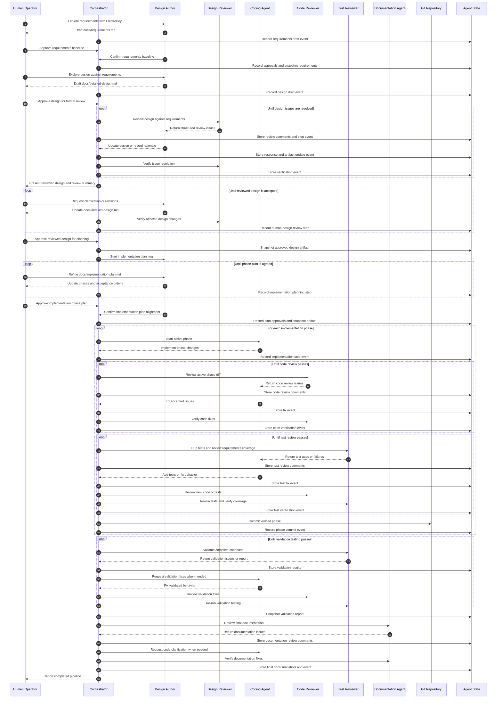
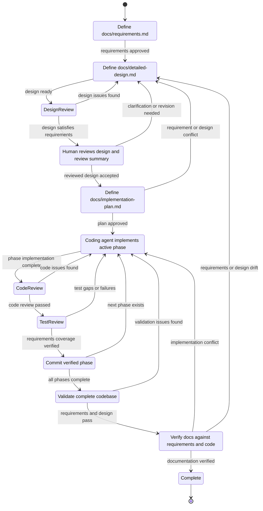

# AI Agent Pipeline Detailed Design

## Table of Contents

- [Purpose](#purpose)
- [Design Approach](#design-approach)
- [Workflow Overview](#workflow-overview)
- [Goals](#goals)
- [Non-Goals](#non-goals)
- [Core Artifacts](#core-artifacts)
- [Pipeline Stages](#pipeline-stages)
  - [Stage 1. Requirements Definition](#stage-1-requirements-definition)
  - [Stage 2. Design Exploration](#stage-2-human-led-design-exploration)
  - [Stage 3. Automated Design Review](#stage-3-automated-design-review)
  - [Stage 4. Human Design Acceptance](#stage-4-human-design-acceptance)
  - [Stage 5. Implementation Strategy](#stage-5-implementation-strategy)
  - [Stage 6. Phase Implementation Loop](#stage-6-phase-implementation-loop)
  - [Stage 7. Validation Testing](#stage-7-validation-testing)
  - [Stage 8. Final Documentation Review](#stage-8-final-documentation-review)
- [Agent Roles](#agent-roles)
- [Orchestrator](#orchestrator)
- [Review Issue Format](#review-issue-format)
- [Run History](#run-history)
- [Context Bundles](#context-bundles)
- [Phase Gate Rules](#phase-gate-rules)
- [Commit Strategy](#commit-strategy)
- [Handling Disagreements](#handling-disagreements)
- [Test Review Expectations](#test-review-expectations)
- [Documentation Expectations](#documentation-expectations)
- [Operational Model](#operational-model)
- [Build Milestones](#build-milestones)
- [Design Decisions](#design-decisions)

## Purpose

This project defines an agent pipeline for moving from a human-guided design
conversation to reviewed, tested, documented implementation work. The workflow
keeps the early creative design process interactive and automates the repeatable
work of review, code production, test assessment, and documentation
verification.

The pipeline is built around a small set of specialized agents. Each agent has a
narrow responsibility, a defined set of inputs, and a controlled authority over
project artifacts. Reviews move through structured issue records so that agents
iterate without losing context or reopening settled decisions accidentally.

## Design Approach

The workflow separates creative design from mechanical execution. Independent
review agents handle design, code, tests, and documentation. Implementation
proceeds through bounded phases so that each unit of work is reviewed, tested,
and committed before the next unit begins.

The design controls coordination drift by using versioned artifacts and
machine-readable run state. It keeps authority clear by giving each agent a
narrow ownership boundary. Review loops terminate through explicit issue
severity, acceptance, rejection, deferral, escalation, and verification rules.

`docs/requirements.md` is the stable baseline for required behavior. The design
describes how the system satisfies those requirements, and downstream agents
check implementation, tests, and documentation against both artifacts.

The human operator remains the final authority for design intent and disputed
tradeoffs. Automated agents perform the repeatable work inside those boundaries.

## Workflow Overview

The sequence diagram shows the agent handoffs and review loops. The state
diagram shows the durable stage transitions and the return paths used when
requirements, design, implementation, tests, or documentation drift from the
approved baseline.





## Goals

- Preserve the human-led design process with ElectroBoy as the primary design
  collaborator.
- Capture system requirements in `docs/requirements.md` before the design is
  finalized.
- Convert an approved design into a detailed implementation strategy with small,
  reviewable phases.
- Require the human operator and Design Author Agent to agree on
  `docs/implementation-plan.md` before automated implementation begins.
- Run design review, code review, and test review as separate loops with clear
  completion gates.
- Require each implementation phase to be coded, reviewed, tested, and committed
  before the next phase begins.
- Keep documentation synchronized with the final codebase.
- Produce enough persistent state for interrupted agent runs to resume without
  guessing.
- Preserve a complete run history of agent steps, review comments, decisions,
  verification results, commands, tests, and commits.

## Non-Goals

- The pipeline does not automate the early exploratory design conversation.
- The pipeline does not let every agent edit every artifact.
- The pipeline does not merge unrelated phases into one large implementation
  pass.
- The pipeline does not treat a passing test suite as proof that tests are
  comprehensive.
- The pipeline does not replace human judgment for disputed architecture
  decisions.

## Core Artifacts

The pipeline revolves around a small number of durable files.

Each pipeline artifact is kept as a working repository file and stored as an
approved run snapshot when it passes a stage gate.

### `docs/requirements.md`

This file defines the system to be built at the behavioral level. It describes
target users, usage workflows, required behavior, constraints, success
criteria, non-goals, and acceptance-level expectations. Later artifacts are
checked against this requirements baseline.

### `docs/detailed-design.md`

This file describes how the target system satisfies `docs/requirements.md`. The
design author agent owns updates during the design review loop. The
documentation agent later verifies that the final code still matches it.

### `docs/implementation-plan.md`

This file breaks the approved design into implementation phases. Each phase
includes scope, expected files or modules, acceptance criteria, test
expectations, and dependency notes.

### `README.md`

The README describes how to clone, build, configure, test, and operate the
codebase. It is written for a new contributor or operator.

### `docs/api.md`

This file describes the public API exposed by the codebase. It includes public
functions, classes, commands, configuration files, data formats, extension
points, and stable behavior guarantees.

### Agent State Directory

The pipeline stores machine-readable state under `.agent-pipeline/`.

Directory layout:

```text
.agent-pipeline/
  runs/
    <run-id>/
      manifest.json
      activity-log.jsonl
      design-review.jsonl
      phase-<n>-code-review.jsonl
      phase-<n>-test-review.jsonl
      validation-review.jsonl
      documentation-review.jsonl
      artifacts/
        requirements.md
        detailed-design.md
        implementation-plan.md
        validation-report.md
        README.md
        api.md
      messages/
        <event-id>.md
  phase-status.json
  decisions.jsonl
```

The files in this directory capture review issues, decisions, phase status, and
run metadata. They are not a substitute for the source documents. They give the
orchestrator and agents a reliable way to resume work and audit past decisions.

`activity-log.jsonl` is the append-only timeline for the run. It records every
agent step, review pass, response, verification, test command, gate decision,
and commit. The review files store the full issue records. The activity log
links those issue records to the events that created, changed, or verified
them.

The `messages/` directory stores the agent-facing text for events that need
full context. Each message file contains the relevant prompt, response,
review text, or command summary. The activity log points to these files by
event id.

The `artifacts/` directory stores approved snapshots of every pipeline
artifact for the run. The working copies remain in their normal repository
locations, and the run snapshots preserve the exact versions used at stage
gates and approvals.

## Pipeline Stages

### Stage 1. Requirements Definition

The human operator works with the Design Author Agent, ElectroBoy, to define
the system requirements. The output is `docs/requirements.md`, which captures
target usage, required behavior, constraints, non-goals, and acceptance-level
expectations.

This stage remains collaborative. Requirements become the baseline used to
review the design, implementation plan, code, tests, and final documentation.

Exit criteria:

- The human operator approves the requirements baseline.
- The Design Author Agent confirms the requirements baseline.
- `docs/requirements.md` describes target users, usage workflows, required
  behavior, constraints, non-goals, and success criteria.
- The activity log records both requirements approvals.

### Stage 2. Human-Led Design Exploration

The human operator works with ElectroBoy to explore the design. This stage
remains interactive and intentionally flexible. The output is a coherent draft
of `docs/detailed-design.md` that satisfies `docs/requirements.md`.

Exit criteria:

- The human operator approves the design draft for formal review.
- The design describes user goals, architecture, responsibilities, workflows,
  data flow, operational expectations, and known constraints.
- The design maps the requirements baseline to concrete architecture and
  behavior.

### Stage 3. Automated Design Review

The design review agent reviews `docs/detailed-design.md` against
`docs/requirements.md` and creates design review issues. The design author
agent updates the document or responds with a rejection rationale.

The loop continues until every required issue is verified, downgraded, or
escalated to the human operator.

Exit criteria:

- No open blocker or major design review issues remain.
- Minor issues are either fixed or explicitly deferred.
- Any disputed design decisions are recorded in
  `.agent-pipeline/decisions.jsonl`.
- The reviewed design is ready for human acceptance.

### Stage 4. Human Design Acceptance

The orchestrator presents the reviewed design, design review summary, open
deferrals, and recorded decisions to the human operator. The human operator
reviews the design before implementation planning begins.

This stage gives the human operator a clear checkpoint between automated design
review and implementation planning. The human can request clarification,
additional design changes, or explicit rationale for accepted tradeoffs. Any
design changes made in this stage return through targeted design review before
the stage can close.

Exit criteria:

- The human operator accepts the reviewed design.
- No requested clarification or design change remains open.
- Any design changes requested by the human operator are verified by the design
  review agent.
- The approved design snapshot is stored under the run artifact directory.
- The activity log records the human design acceptance event.

### Stage 5. Implementation Strategy

The Design Author Agent and human operator convert the approved requirements
and accepted design into `docs/implementation-plan.md`. The plan divides work
into small phases that are coded, reviewed, tested, and committed
independently.

This stage remains collaborative. ElectroBoy and the human operator iterate on
phase boundaries, acceptance criteria, dependencies, test expectations, and
documentation impact until both agree that the plan is ready for automated
implementation.

The human operator reviews the completed phase plan before the coding agent
starts. This review gives the human operator a concrete understanding of the
planned implementation sequence and makes later interaction with the codebase
easier.

Each phase includes:

- Objective.
- Scope.
- Out-of-scope items.
- Expected files or modules.
- Acceptance criteria.
- Required tests.
- Public API or documentation impact.
- Dependencies on earlier phases.

Exit criteria:

- Every phase has a bounded scope.
- Dependencies between phases are explicit.
- The first phase begins without unresolved design questions.
- The human operator approves `docs/implementation-plan.md`.
- The Design Author Agent confirms that the plan matches the reviewed design.
- The implementation plan traces each phase to relevant requirements.
- The approved implementation-plan snapshot is stored under the run artifact
  directory.
- The activity log records both approvals before automated implementation
  begins.

### Stage 6. Phase Implementation Loop

The coding agent implements one phase from `docs/implementation-plan.md`.

The basic loop is:

1. The coding agent implements the active phase.
2. The code review agent reviews the implementation.
3. The coding agent fixes accepted review issues.
4. The code review agent verifies the fixes.
5. The test review agent runs tests and evaluates test completeness.
6. The coding agent implements requested tests or fixes.
7. The code review agent reviews any new code or tests.
8. The test review agent re-runs tests and verifies coverage.
9. The coding agent commits the phase after all gates pass.

The next phase starts only after the current phase commit exists.

Exit criteria for each phase:

- All blocker and major code review issues are resolved.
- All blocker and major test review issues are resolved.
- Required tests pass.
- The implementation matches the phase acceptance criteria.
- Documentation touched by the phase is updated when needed.
- The phase commit is created with a clear commit message.

### Stage 7. Validation Testing

The Test Review Agent validates the completed codebase after all implementation
phases are committed. This stage checks the integrated system against
`docs/requirements.md` and `docs/detailed-design.md`, rather than checking only
the active phase.

Validation testing covers full workflows, cross-phase integration, public
behavior, error paths, configuration behavior, and requirement-level success
criteria. The validation pass produces `validation-review.jsonl` findings and
a `validation-report.md` artifact for the run.

When validation finds a blocker or major issue, the orchestrator returns work
to the coding agent. Validation fixes go through code review and test review
before validation testing runs again.

Exit criteria:

- The full test suite passes.
- Requirement-level workflows pass validation testing.
- Public behavior matches `docs/requirements.md`.
- Integrated behavior and architecture match `docs/detailed-design.md`.
- No blocker or major validation review issues remain.
- Validation commands, results, and findings are stored in the activity log.
- `validation-review.jsonl` and `validation-report.md` are stored for the run.

### Stage 8. Final Documentation Review

The documentation agent reviews the completed codebase and documentation.

The documentation pass verifies four levels of documentation:

- `docs/requirements.md` accurately describes the implemented behavior.
- `docs/detailed-design.md` accurately describes the implemented architecture.
- `README.md` explains clone, build, configuration, test, and usage workflows.
- `docs/api.md` documents the public API and stable behavior.

Exit criteria:

- No blocker or major documentation review issues remain.
- Requirements documentation matches the implemented behavior.
- Public API documentation matches the code.
- The README is complete enough for a new contributor to follow successfully.
- Design documentation reflects the final implementation.

## Agent Roles

Requirements definition is owned by the Design Author Agent and the human
operator. The baseline pipeline does not introduce a separate requirements
review agent. Later review agents validate design, implementation, tests, and
documentation against the approved requirements baseline.

The roles below reference the pipeline stages defined above. Each role owns or
participates in a specific part of the stage flow.

### A. Design Author Agent

The design author agent is the original design collaborator. In this project
that role is ElectroBoy.

This agent leads artifact authoring in Stage 1, Stage 2, and Stage 5,
responds to review findings during Stage 3, and supports human design
acceptance in Stage 4.

Responsibilities:

- Collaborate with the human operator during requirements definition and
  design exploration.
- Write and revise `docs/requirements.md`.
- Write and revise `docs/detailed-design.md`.
- Collaborate with the human operator on `docs/implementation-plan.md` after
  the reviewed design is accepted.
- Write and revise implementation phases, acceptance criteria, dependencies,
  and test expectations.
- Respond to design review comments from the design review agent.
- Record accepted design changes in the design document.
- Explain rejected review comments with a concrete rationale.

Authority:

- Edits `docs/requirements.md` during requirements definition.
- Edits `docs/detailed-design.md`.
- Edits `docs/implementation-plan.md` during implementation planning.
- Proposes updates to `docs/implementation-plan.md` when a later design change
  affects phase structure.
- Does not edit production code during design review.
- Does not change the approved implementation plan after coding begins unless
  the orchestrator returns to the implementation strategy stage.

### B. Design Review Agent

The design review agent challenges the design before implementation begins.

This agent participates in Stage 3.

Responsibilities:

- Review `docs/detailed-design.md` against `docs/requirements.md` for
  ambiguity, missing requirements, inconsistent assumptions, operational gaps,
  testability problems, security risks, and implementation hazards.
- Produce structured review issues for the design author agent.
- Verify that design changes resolve review issues.
- Distinguish required fixes from optional improvements.

Authority:

- Creates and updates design review issue records.
- Suggests text, diagrams, and acceptance criteria.
- Does not directly edit `docs/detailed-design.md`.

### C. Coding Agent

The coding agent implements the approved plan one phase at a time.

This agent owns implementation work during Stage 6.

Responsibilities:

- Read the approved requirements, detailed design, and implementation plan
  before each phase.
- Implement only the active phase scope.
- Add or update tests requested by the implementation plan or test review agent.
- Address code review findings.
- Commit each completed phase after review and test gates pass.

Authority:

- Edits production code, tests, build files, and developer documentation within
  the active phase.
- Edits `README.md` or `docs/api.md` when the active phase changes usage or
  public API details.
- Does not modify the approved design unless the orchestrator sends the work
  back through the design loop.

### D. Code Review Agent

The code review agent reviews each phase after the coding agent completes the
implementation pass.

This agent participates in the code review loop during Stage 6.

Responsibilities:

- Review diffs against the requirements, active phase scope, and approved
  design.
- Identify correctness bugs, maintainability problems, security issues, API
  inconsistencies, missing error handling, and risky deviations from local
  project style.
- Produce structured review issues for the coding agent.
- Verify fixes before the phase proceeds.

Authority:

- Creates and updates code review issue records.
- Requests code changes and test changes.
- Does not directly edit implementation files.

### E. Test Review Agent

The test review agent evaluates both test execution and test quality.

This agent participates in the phase test review loop during Stage 6 and owns
validation testing in Stage 7.

Responsibilities:

- Run the project test suite.
- Inspect existing tests for coverage of requirements, phase acceptance
  criteria, edge cases, failure modes, integration paths, and regression risk.
- Propose new or revised tests when coverage is weak.
- Re-run tests after the coding agent implements requested tests.
- Verify that the test suite gives meaningful confidence for the active phase.
- Validate the completed codebase against `docs/requirements.md` and
  `docs/detailed-design.md` after all phases are committed.
- Produce validation review issues and a validation report.

Authority:

- Creates and updates test review issue records.
- Creates and updates validation review issue records.
- Requests tests from the coding agent.
- Requests validation fixes from the coding agent.
- Does not directly edit test files.

### F. Documentation Agent

The documentation agent verifies final documentation after implementation work
and validation testing are complete.

This agent owns the documentation review work in Stage 8.

Responsibilities:

- Compare `docs/requirements.md` with the implemented code and final
  documentation.
- Compare `docs/detailed-design.md` with the implemented code.
- Ensure `README.md` explains clone, build, configuration, test, and normal
  usage workflows.
- Ensure `docs/api.md` documents the public API in enough detail for a
  downstream user or contributor.
- Produce documentation review issues when code and docs diverge.
- Verify documentation fixes before the project is considered complete.

Authority:

- Edits documentation files.
- Requests code clarification from the coding agent when the implementation is
  ambiguous.
- Does not change production behavior.

## Orchestrator

The orchestrator coordinates agents, artifacts, and phase gates. The baseline
implementation is a local CLI-driven workflow. Its essential job is to enforce
order and preserve state.

Responsibilities:

- Assign the active stage and active implementation phase.
- Provide each agent with the correct context bundle.
- Reconstruct reviewer context from artifacts, issue records, decisions,
  activity-log events, diffs, and test output.
- Store review issues in the agent state directory.
- Append every agent action, review pass, response, verification, command, and
  commit to the run activity log.
- Store approved pipeline artifact snapshots in the run artifact directory.
- Prevent formal design review before the requirements baseline is approved.
- Prevent implementation planning before human acceptance of the reviewed
  design.
- Prevent coding work before design review is complete.
- Prevent coding work before the human operator and Design Author Agent approve
  `docs/implementation-plan.md`.
- Prevent a phase commit before code review and test review are complete.
- Prevent final documentation review before validation testing passes.
- Return work to the requirements and design stages when later review exposes a
  requirements gap, conflict, or drift.
- Halt and request human input when agents disagree about design intent or
  scope.
- Record decisions that affect future phases.

The orchestrator treats each agent response as an input to a state transition.
Durable artifacts and run state are the source of truth.

## Review Issue Format

Every review comment is stored as a structured issue. A consistent format lets
agents verify fixes and prevents duplicate findings from drifting across
iterations.

Issue fields:

```json
{
  "id": "DESIGN-001",
  "stage": "design-review",
  "phase": null,
  "severity": "major",
  "status": "open",
  "owner": "design-author",
  "artifact": "docs/detailed-design.md",
  "location": "Section name or file:line",
  "summary": "The design does not define how review loops terminate.",
  "rationale": "Without exit criteria the automated pipeline cycles indefinitely.",
  "requested_change": "Add loop termination criteria for each review stage.",
  "response": null,
  "verification": null
}
```

Severity values:

- `blocker` means the stage cannot proceed.
- `major` means the stage cannot proceed without a fix or human waiver.
- `minor` means the issue is fixed when practical.
- `nit` means the issue is cosmetic or editorial.

Status values:

- `open` means the issue needs action.
- `accepted` means the responsible agent agrees and is working on it.
- `fixed` means the responsible agent claims the issue is addressed.
- `verified` means the reviewing agent confirms the fix.
- `rejected` means the responsible agent disagrees and has provided a rationale.
- `deferred` means the issue is intentionally moved outside the current stage.
- `escalated` means human input is required.

## Run History

The pipeline records an append-only activity log for every run. This log gives
the human operator and future analysis tools a chronological explanation of how
the agents worked together and how the final state emerged.

Each event captures the actor, stage, phase, action, inputs, outputs, artifact
changes, linked review issues, gate result, and follow-up owner when those
fields apply. Events never replace source artifacts, review issue files, or
commits. They connect those artifacts into an auditable sequence.

Event fields:

```json
{
  "id": "EVT-00042",
  "timestamp": "2026-07-05T14:30:00Z",
  "actor": "code-review-agent",
  "stage": "phase-implementation",
  "phase": 2,
  "action": "review-submitted",
  "summary": "Found missing validation for phase configuration input.",
  "inputs": [
    "docs/requirements.md",
    "docs/detailed-design.md",
    "docs/implementation-plan.md"
  ],
  "outputs": ["phase-2-code-review.jsonl"],
  "linked_issue_ids": ["CODE-014"],
  "artifact_changes": [],
  "artifact_snapshot_refs": [],
  "commands": [],
  "message_ref": "messages/EVT-00042.md",
  "commit": null
}
```

The activity log supports three analysis tasks:

- Reconstruct the order of agent decisions and review loops.
- Explain why a design, code, test, or documentation change was made.
- Compare agent behavior across runs, phases, and review categories.

## Context Bundles

The pipeline uses a stateful orchestration model with mostly stateless agents.
Durable artifacts, review issue records, decisions, commits, and the activity
log are the memory of the system. The orchestrator reconstructs each agent's
working context from those sources before every agent invocation.

Review agents do not keep hidden conversational context between review
iterations. The design review agent, code review agent, test review agent, and
documentation agent start each review pass from a curated context bundle. This
keeps their findings reproducible and prevents stale assumptions from carrying
forward after the artifact under review changes.

The context bundle still gives each reviewer continuity. It includes the
current artifact, open issues, prior verified issues, rejected or deferred
issues, relevant decisions, activity-log events, diffs, test output, and phase
scope when those inputs apply. Reviewers use this durable context to avoid
repeating resolved comments and to verify whether a claimed fix addressed the
original concern.

The coding agent keeps short-lived working context during an active phase. The
phase truth still lives in source changes, review issue records, test results,
commits, and the activity log. When a phase ends, the next coding pass starts
from the repository state and the curated context bundle for that phase.

The Design Author Agent keeps richer conversational continuity during
human-led design exploration and implementation planning. After automated
implementation begins, `docs/requirements.md`, `docs/detailed-design.md`,
`docs/implementation-plan.md`, recorded decisions, and the activity log become
the source of truth for design intent.

Each agent receives only the context needed for its role, plus enough shared
state to avoid contradictory work.

### Design Author Context

- Current `docs/requirements.md`.
- Current `docs/detailed-design.md`.
- Current `docs/implementation-plan.md` during implementation planning.
- Open design review issues.
- Relevant decisions from `.agent-pipeline/decisions.jsonl`.
- Implementation plan approval status.
- Human instructions and constraints.

### Design Reviewer Context

- Approved `docs/requirements.md`.
- Current `docs/detailed-design.md`.
- Prior design review issues.
- Relevant decisions.
- Relevant activity-log events.
- Target implementation constraints.

### Coding Agent Context

- Approved `docs/requirements.md`.
- Approved `docs/detailed-design.md`.
- Approved `docs/implementation-plan.md`.
- Active phase definition.
- Open code review and test review issues for the phase.
- Current repository state.

### Code Reviewer Context

- Approved requirements.
- Approved design.
- Active phase definition.
- Diff for the active phase.
- Prior review issues for the phase.
- Relevant activity-log events.
- Project style and test conventions.

### Test Reviewer Context

- Approved requirements.
- Approved design.
- Active phase definition.
- Current test suite.
- Test outputs.
- Prior test review issues for the phase.
- Relevant activity-log events.
- Relevant diffs.

### Validation Testing Context

- Approved `docs/requirements.md`.
- Approved `docs/detailed-design.md`.
- Approved `docs/implementation-plan.md`.
- Completed codebase.
- Full test suite and validation test commands.
- Phase commits and phase review history.
- Open or deferred code review and test review issues.
- Relevant activity-log events.
- Prior validation review issues.

### Documentation Agent Context

- Final codebase.
- `docs/requirements.md`.
- `docs/detailed-design.md`.
- `README.md`.
- `docs/api.md`.
- Implementation plan and phase commits.
- Validation report and validation review history.
- Activity log and review issue history.

## Phase Gate Rules

The pipeline enforces gates with explicit checks.

Requirements gate:

- `docs/requirements.md` exists.
- The human operator has approved the requirements baseline.
- The Design Author Agent has confirmed the requirements baseline.
- The approved requirements snapshot is stored under the run artifact
  directory.
- The activity log records both requirements approvals.

Design gate:

- `docs/requirements.md` exists.
- `docs/detailed-design.md` exists.
- The design maps approved requirements to architecture and behavior.
- Design review has no unresolved blocker or major issues.
- Escalated issues have human decisions.

Human design acceptance gate:

- The orchestrator has presented the reviewed design and design review summary
  to the human operator.
- The human operator has accepted the reviewed design.
- Requested clarifications or design changes are closed.
- Human-requested design changes have design review verification.
- The approved design snapshot is stored under the run artifact directory.

Implementation gate:

- `docs/requirements.md` exists.
- `docs/implementation-plan.md` exists.
- The human operator has approved `docs/implementation-plan.md`.
- The Design Author Agent has confirmed plan alignment with the reviewed
  design.
- The implementation plan traces phases to approved requirements.
- The approved implementation-plan snapshot is stored under the run artifact
  directory.
- The active phase is marked ready.
- Earlier phases are committed.

Code review gate:

- Code review has no unresolved blocker or major issues for the active phase.
- Code review has checked the active phase against relevant requirements.
- Rejected code review issues have reviewer verification or human waiver.

Phase test review gate:

- Required tests pass.
- Test review has no unresolved blocker or major issues for the active phase.
- Test review has checked coverage of relevant requirements.
- Missing coverage findings are fixed, deferred, or escalated.

Commit gate:

- Working tree changes belong to the active phase.
- Code review and phase test review gates pass.
- Commit message identifies the phase and the completed objective.

Validation testing gate:

- All planned phases are committed.
- The full test suite passes.
- Validation testing has checked the completed codebase against
  `docs/requirements.md`.
- Validation testing has checked integrated behavior and architecture against
  `docs/detailed-design.md`.
- No blocker or major validation review issues remain.
- Validation commands, results, and findings are stored in the activity log.
- `validation-review.jsonl` and `validation-report.md` are stored for the run.

Documentation gate:

- `docs/requirements.md`, `docs/detailed-design.md`, `README.md`, and
  `docs/api.md` exist.
- Documentation review has no unresolved blocker or major issues.
- Validation testing gate has passed.
- The documented requirements match the implemented behavior.
- The documented API matches the implemented public API.
- Final documentation snapshots are stored under the run artifact directory.
- The run activity log contains review and verification events for every stage.

## Commit Strategy

The coding agent creates one commit per completed phase. Additional commits are
reserved for phases that the implementation plan explicitly splits into
sub-phases or fixes that are easier to audit separately.

Commit message shape:

```text
phase <n>: <short objective>

Implement <phase objective>.

Review gates:
- Code review: verified
- Test review: verified
- Tests: <command summary>
```

The commit body mentions major design decisions only when they are important for
future maintainers. Routine issue resolution belongs in review records, not in
every commit message.

## Handling Disagreements

Agents sometimes disagree about severity, scope, or correctness. The pipeline
uses a small set of resolution paths.

Accepted issue:

- The responsible agent agrees with the finding.
- The responsible agent updates the artifact.
- The reviewer verifies the fix.

Rejected issue:

- The responsible agent records a rationale.
- The reviewer either accepts the rationale or escalates.

Deferred issue:

- The issue is valid but belongs outside the current stage or phase.
- The deferral records a target phase or follow-up owner.

Escalated issue:

- The agents cannot resolve the question from available artifacts.
- The human operator makes the decision.
- The decision is recorded for future stages.

Requirements change:

- A later stage finds a missing, conflicting, or incorrect requirement.
- The orchestrator returns to requirements definition and design exploration.
- The human operator and Design Author Agent update the affected artifacts.
- Downstream stages resume only after the updated gates pass.

## Test Review Expectations

The Test Review Agent evaluates tests against risk, not only line or branch
coverage. It performs phase-level test review during Stage 6 and full
validation testing during Stage 7.

During phase-level review, it checks:

- Requirements linked to the active phase.
- Acceptance criteria from the implementation plan.
- Primary success paths.
- Boundary conditions.
- Error and recovery paths.
- Configuration and environment differences.
- Integration points with earlier phases.
- Regression risk from changed behavior.
- Public API compatibility.

When proposing tests, the test review agent states the risk being covered and
the expected failure mode if the test is missing. The coding agent then
implements the requested tests and sends the changes through code review.

During validation testing, it checks the completed codebase against the
approved requirements and detailed design. This validation pass covers major
usage workflows, cross-phase integration, public behavior, configuration
behavior, failure modes, and end-to-end requirement success criteria.

Validation findings are stored as structured issues in
`validation-review.jsonl`. The validation report records the commands run, test
results, requirements covered, design behaviors checked, gaps found, and any
fixes required before final documentation review begins.

## Documentation Expectations

The final documentation pass reads the repository from a user's perspective.

`docs/requirements.md` explains:

- Target users and usage workflows.
- Required system behavior.
- Constraints and assumptions.
- Non-goals.
- Success criteria.
- Acceptance-level expectations.

`docs/detailed-design.md` explains:

- System architecture.
- Requirement-to-design mapping.
- Agent responsibilities.
- Pipeline stages.
- State files and review records.
- Run history and activity-log behavior.
- Phase gates and completion criteria.
- Operational assumptions and known limits.

`README.md` explains:

- Repository purpose.
- Prerequisites.
- Clone and setup steps.
- Build instructions.
- Test commands.
- Basic usage.
- Troubleshooting notes.

`docs/api.md` explains:

- Public modules, classes, functions, commands, or configuration files.
- Input and output formats.
- Error behavior.
- Stability guarantees.
- Examples for common use.

## Operational Model

The baseline deployment model is a local CLI-driven workflow. The orchestrator
invokes agents through role-specific prompts, stores issue records, and requires
explicit gate checks before moving to the next stage.

The architecture includes extension points for a service layer, dashboard,
queue, and GitHub integration. Those extensions preserve the same core model.
Agents remain specialized, artifacts remain durable, and phase gates remain
explicit.

## Build Milestones

1. Define the requirements, design, implementation-plan, and review issue
   templates.
2. Implement a minimal orchestrator that runs the requirements and design
   loops.
3. Add human design acceptance and implementation-plan approval gates.
4. Add approved artifact snapshots under each run directory.
5. Add implementation phase tracking and phase gate checks.
6. Add code review and test review loops for one phase at a time.
7. Add validation testing against requirements and design.
8. Add commit automation after gates pass.
9. Add the final documentation review pass.
10. Add resume support from `.agent-pipeline/` state.

## Design Decisions

- The baseline orchestrator is a local CLI workflow.
- Agent runtimes are isolated behind role adapters.
- `docs/requirements.md` is the source of truth for required system behavior.
- Design, implementation planning, code review, test review, and final
  documentation review check their artifacts against the requirements baseline.
- Validation testing checks the completed codebase against the approved
  requirements and detailed design before final documentation review begins.
- The pipeline is stateful and review agents are invoked with reconstructed
  context instead of persistent hidden conversational memory.
- The orchestrator owns pipeline memory through artifacts, review records,
  decisions, commits, and activity logs.
- The coding agent uses short-lived phase context, but phase truth remains in
  repository state and run records.
- The Design Author Agent keeps richer conversational continuity during
  human-led design and implementation planning.
- Review issues are stored as JSONL under `.agent-pipeline/runs/<run-id>/`.
- Agent actions are stored in append-only activity logs under each run
  directory.
- Full agent-facing messages are stored under
  `.agent-pipeline/runs/<run-id>/messages/`.
- Approved pipeline artifacts are stored as snapshots under
  `.agent-pipeline/runs/<run-id>/artifacts/`.
- Phase status is stored in `.agent-pipeline/phase-status.json`.
- Cross-stage decisions are stored in `.agent-pipeline/decisions.jsonl`.
- Phase commits are created on the active working branch after gates pass.
- Human approval is required for requirements acceptance, reviewed design
  acceptance, implementation plan acceptance, escalated decisions, and final
  completion.
- Implementation planning starts only after human acceptance of the reviewed
  design.
- Design Author Agent confirmation is required for requirements acceptance.
- Design Author Agent confirmation is required for implementation plan
  acceptance.
- Per-phase human approval is available as an orchestrator policy, but it is not
  a default phase gate.
